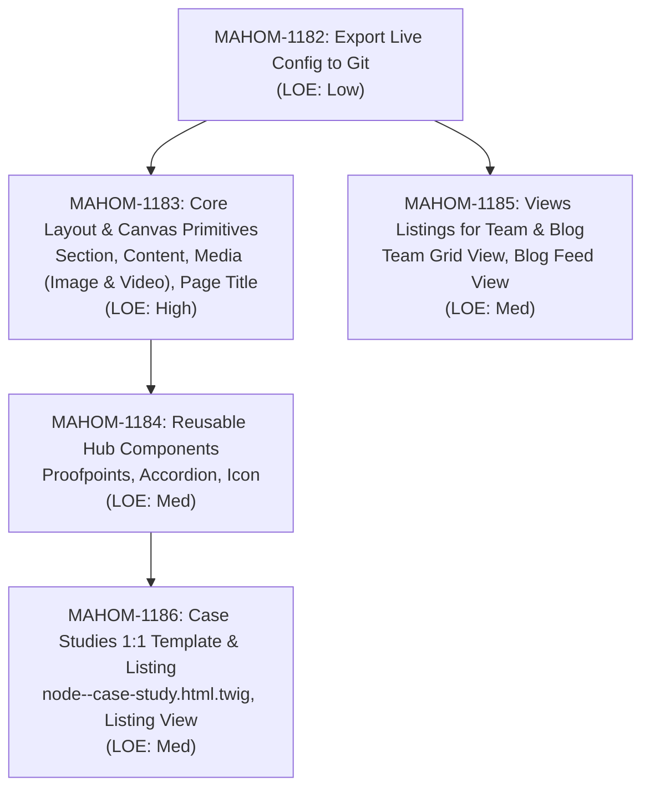

# Component Migration & Frontend Roadmap

Status: Active shared implementation plan
Audience: Contributors working on the CivicActions homesite rebuild
Target end date: November 1, 2026
Last reviewed: 2026-10-08

This plan records the complete component migration strategy from the legacy Strapi/Gatsby homesite to Drupal 11 and Drupal CMS 2.0. It coordinates the delivery of Twig Single Directory Components (SDCs), Drupal Canvas visual authoring integration, and structured Drupal Views listings.

For component styling standards, see [canon.md](../specs/canon.md). For design token definitions, see [design-tokens.md](../specs/design-tokens.md). For platform architecture decisions, see [ADR-0001](../decisions/0001-drupal-canvas-sdc-architecture.md).

---

## 1. Problem & Intended Outcome

The legacy homesite relied on a decoupled Gatsby frontend paired with a headless Strapi CMS and hardcoded React components. This split created editorial bottlenecks, duplicated layout code, and required engineering intervention for routine content and navigation updates.

The rebuild delivers an integrated Drupal CMS 2.0 architecture where:
- Content authors compose landing pages visually using Drupal Canvas and reusable, accessible SDCs.
- Structured content types (Case Studies, Editorial Articles, and Person listings) use semantic Twig templates and Views without requiring manual page assembly.
- Frontend components strictly encapsulate styles using the `.ca-` namespace and `@scope` progressive enhancement, eliminating bleed into Drupal admin chrome.

---

## 2. Component Migration Matrix

The homesite team audited all 39 legacy components and patterns against public production pages and editorial requirements:

| Legacy Component / Pattern | Audit Analysis & Architectural Decision | Status | Target Drupal SDC or Architecture | Ticket Reference | LOE |
| :--- | :--- | :--- | :--- | :--- | :--- |
| **`primary-page-cta.js`** | Full-width call-to-action banner supporting default (blue) and home (red) variants. | **Merged** | `omnichannel:primary-page-cta` | MAHOM-1167 | Done |
| **`link-button.js`** | Primary and secondary interactive link button primitive with default and large sizes. | **Merged** | `omnichannel:link-button` | MAHOM-1167 | Done |
| **`external-link-button.js`** | External link button. Folded into generalized button primitive with protocol sanitization. | **Merged** | Consolidated into `omnichannel:link-button` | MAHOM-1167 | Done |
| **`ditap-page-cta.js`** | Offering-specific CTA. Retired as duplicate; replaced with standard primary CTA variant. | **Merged** | Consolidated into `omnichannel:primary-page-cta` | MAHOM-1167 | Done |
| **`card.js`** | Linked card with icon, title, and body for offerings and service highlights. | **Merged** | `omnichannel:card` | MAHOM-1167 | Done |
| **`case-study-teaser.js`** | Teaser card for case study previews on Home, Services, and listing grid. | **Merged** | `omnichannel:case-study-teaser` | MAHOM-1167 | Done |
| **`press-release-teaser.js`** | Press release teaser. Consolidated into generalized editorial teaser supporting image card and compact text feed. | **Merged** | `omnichannel:editorial-teaser` | MAHOM-1167 | Done |
| **`hero-with-buttons.js`** | Comprehensive hero with eyebrow, heading, summary, image, and double CTAs. | **Merged** | `omnichannel:hero` | MAHOM-1179 (PR #14) | Done |
| **`hero.js`** | Basic hero without CTAs. Consolidated into base hero component with optional action links. | **Merged** | Consolidated into `omnichannel:hero` | MAHOM-1179 | Done |
| **`case-study-hero.js`** | Content-specific case study hero. Consolidated into unified hero component. | **Merged** | Consolidated into `omnichannel:hero` | MAHOM-1179 | Done |
| **`quote.js`** | Testimonial quote with author citation, supporting optional portrait thumbnail. | **Merged** | `omnichannel:quote` | MAHOM-1167 | Done |
| **`staff-quote.js`** | Staff quote variant. Consolidated into unified quote component. | **Merged** | Consolidated into `omnichannel:quote` | MAHOM-1167 | Done |
| **`header.js` & `menus/main-menu/*`** | Sitewide header, desktop flyouts, mobile hamburger drawer, and skip link. | **Merged** | `omnichannel:main-menu` & `header.html.twig` | MAHOM-1168 (PR #18) | Done |
| **`red-header.js`** | Alternate red header variant. De-scoped; single cohesive header shell adopted sitewide. | **De-scoped** | Single header shell adopted sitewide | MAHOM-1168 | N/A |
| **`footer.js` & `menus/footer-menu.js`** | Sitewide multi-column footer, about summary, contact info, and legal links. | **Merged** | `omnichannel:site-footer` & partials | MAHOM-1174 | Done |
| **`social-icons/*`** | Social link collection (LinkedIn, GitHub) rendered in footer. | **Merged** | `omnichannel:social-links` | MAHOM-1174 | Done |
| **`skip-nav.js`** | Skip to main content accessibility control. | **Merged** | Built into page template shell | MAHOM-1175 | Done |
| **`teaser-grid.js`** | Staff card with portrait, name, and role for Team and offering pages. | **Merged** | `omnichannel:person-teaser` | MAHOM-1180 (PR #19) | Done |
| **`offering/bio.js`** | Short inline bio on person cards. Provided via optional bio prop. | **Merged** | Provided via `bio` prop in `omnichannel:person-teaser` | MAHOM-1180 | Done |
| **`-` (Layout Section)** | Responsive CSS Grid layout container (2, 3, 4 columns). Needs anchor ID and optional section title for in-page jump navigation. | **Planned** | `omnichannel:section` updates | MAHOM-1183 | High |
| **`Text` (WYSIWYG)** | Rich text container for Utility pages (Privacy, 404) and service descriptions. Scoped typography (`@scope`) without admin bleed. | **Planned** | `omnichannel:content` | MAHOM-1183 | High |
| **`Image` & `video.js` (Media SDC)** | Unified media embed primitive supporting responsive images and video embeds (16:9 ratio, caption, transcript support). | **Planned** | `omnichannel:media` | MAHOM-1183 | High |
| **`page-title`** | Standalone semantic H1 heading component for Canvas landing pages, resolving Axe heading order violations. | **Planned** | `omnichannel:page-title` | MAHOM-1183 | High |
| **`Proofpoints`** | Key statistical metrics (1 to 3 items, with or without boxed card background). Used on offering pages and Case Studies. | **Planned** | `omnichannel:proofpoints` | MAHOM-1184 | Med |
| **`Accordions`** | Collapsible disclosure items on offering pages and FAQs. Supports section title field and unlimited items with full keyboard access. | **Planned** | `omnichannel:accordion` | MAHOM-1184 | Med |
| **`icons.js`** | Scalable SVG icons for offering highlights. Carries over existing icon set as primitives. | **Planned** | `omnichannel:icon` | MAHOM-1184 | Med |
| **`/team` Views Listing** | Views grid for `/team` filtered by role category. Cards remain unlinked for MVP (individual profile pages deferred). | **Planned** | Team Listing View (`views.view.team`) | MAHOM-1185 | Med |
| **`/blog` Views Listing** | Views feed for `/blog` with category filtering, rendering `editorial-teaser` in card and compact modes. | **Planned** | Blog / Editorial View (`views.view.blog`) | MAHOM-1185 | Med |
| **Case Study Node Template** | Structured 1:1 reproduction of legacy Case Studies assembling Hero, Proofpoints, Content, Media, and Quote SDCs without manual Canvas assembly. | **Planned** | `node--case-study.html.twig` | MAHOM-1186 | Med |
| **Case Studies Grid Listing** | Responsive teaser grid at `/case-studies` rendering `case-study-teaser` cards with category filters. | **Planned** | Case Studies View (`views.view.case_studies`) | MAHOM-1186 | Med |
| **`sidebar.js`** | Legacy sticky sidebar. Replaced by Section SDC anchor jump links (`#web-cms`, etc.) on landing pages. | **De-scoped** | Replaced by Section SDC jump anchors | MAHOM-1183 | N/A |
| **`clients.js`** | Client logo grid. Placed via standard Canvas media and layout blocks rather than custom code. | **De-scoped** | Standard Canvas media/grid blocks | Editorial | N/A |
| **`tabmobile.js`** | Mobile tab navigation. Redesigned into standard responsive disclosures. | **De-scoped** | Permanently retired | N/A | N/A |
| **`sections.js`** | Generic legacy content renderer. Replaced by Drupal Canvas layout system. | **Retired** | Replaced by Drupal Canvas layout system | N/A | N/A |
| **`seo.js`** | Social sharing and SEO tags. Handled via Drupal `metatag` module configuration (Dublin Core and Open Graph). | **Backend Core** | Drupal `metatag` module config | Core Config | Low |
| **`pagination.js`** | Pagination navigation. | **Core Views** | Drupal core Views mini/full pager | MAHOM-1185, MAHOM-1186 | Done in View |
| **`banner.js`** | Dismissible announcement banner. Placed via Canvas block. | **Canvas** | Standard Canvas banner block | Editorial | Low |
| **Careers Job Board (`/careers/`)** | Job board feed. Implemented as custom Drupal PHP block fetching Greenhouse JSON API, avoiding React dependencies. | **Backend Module** | Custom Drupal block plugin | Backend | Med |
| **Configuration Sync** | Pull Pantheon Live database locally, export config to git (`config/`), and establish PR workflow. | **DevOps** | Drupal config export (`ddev drush cex -y`) | MAHOM-1182 | Low |

---

## 3. Batched Implementation Phases

The remaining delivery work is grouped into five ordered batches:



### Phase 1: DevOps Pre-Flight Configuration Sync (MAHOM-1182)
- **Problem:** Initial content types and taxonomies were created directly in the production CMS environment, while `config/` in git remains unpopulated.
- **Approach:** Pull production database locally, run `drush cex -y`, review configuration diff (content types, field storages, displays, vocabularies, and anonymous permissions), and open a pull request into `master`. Import downstream on lower environments.
- **Outcome:** Git becomes the single source of truth for site configuration.

### Phase 2: Core Layout & Canvas Primitives (MAHOM-1183)
- **Problem:** Canvas landing pages lack basic text, media, and heading primitives, and the Section SDC cannot support in-page anchor navigation.
- **Approach:**
  - Update `omnichannel:section` with optional `section_id` and `title` props.
  - Build `omnichannel:content` providing scoped prose typography (`@scope (.ca-content)`) without admin theme bleed.
  - Build `omnichannel:media` supporting responsive images and 16:9 video embeds with captions and transcript links.
  - Build `omnichannel:page-title` outputting a semantic H1 to resolve heading hierarchy accessibility errors.
- **Outcome:** Unblocks landing page authoring and resolves Axe accessibility violations.

### Phase 3: Reusable Hub Components (MAHOM-1184)
- **Problem:** Offering and campaign pages require statistical callouts, collapsible disclosures, and feature icons.
- **Approach:**
  - Build `omnichannel:proofpoints` supporting 1 to 3 key metrics with optional boxed card styling.
  - Build `omnichannel:accordion` with group title and accessible keyboard navigation.
  - Build `omnichannel:icon` bundling SVG primitives with color and size tokens.
- **Outcome:** Fulfills requirements for DITAP, Case Studies, and Homepage feature callouts.

### Phase 4: Views Listings for Team & Blog (MAHOM-1185)
- **Problem:** Backend content migrations cannot be visually validated without listing views.
- **Approach:**
  - Build `/team` Views listing grouped by role category, rendering unlinked `person-teaser` cards (profile pages deferred post-MVP).
  - Build `/blog` Views feed with category filtering, rendering `editorial-teaser` in card and compact modes.
  - Confirm public anonymous view permissions for taxonomy vocabularies.
- **Outcome:** Unblocks staff and blog migrations.

### Phase 5: Case Studies 1:1 Structured Reproduction (MAHOM-1186)
- **Problem:** Assembling repeating case studies manually in Canvas introduces layout drift and excessive authoring effort.
- **Approach:**
  - Theme `node--case-study.html.twig` to automatically assemble Hero, Proofpoints, Content, Media, and Quote SDCs from node fields.
  - Build `/case-studies` Views grid with category filtering.
- **Outcome:** 1:1 legacy layout reproduction with zero manual page assembly for editors.

---

## 4. Integration Boundaries

- **Greenhouse Job Board:** Handled as a custom Drupal PHP block fetching JSON from the Greenhouse API, avoiding React dependencies or frontend SDC complexity.
- **SEO & Social Metadata:** Sitewide metadata handled via Drupal's `metatag` module (Dublin Core and Open Graph submodules), not custom Twig meta injections.
- **Taxonomy Permissions:** Core taxonomy access defaults to restricted in Drupal CMS; public vocabularies must have explicit anonymous view permissions exported in `config/`.

---

## 5. Validation Standards

Every component and layout change must satisfy the repository validation baseline before merge:

```text
ddev drush cr
ddev lint-css
ddev lint-js
cd web/themes/omnichannel && npm run build-storybook
```

Additionally:
- Review in theme-local Storybook across mobile (375px), tablet (768px), and desktop (1024px, 1280px) breakpoints.
- Perform pointer drag-and-drop verification in Drupal Canvas on the disposable draft page (`/canvas/editor/canvas_page/1`).
- Run Axe DevTools auditing to guarantee zero WCAG 2.1 AA violations.
